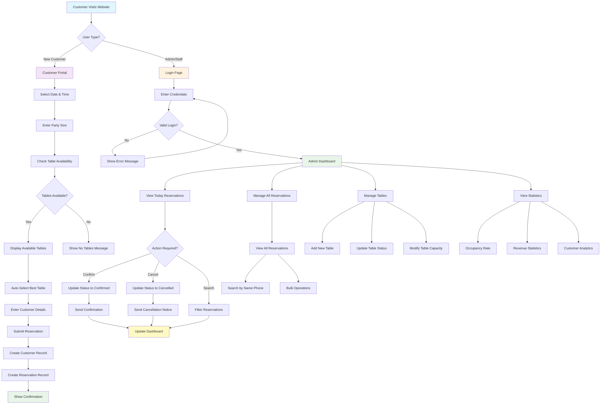
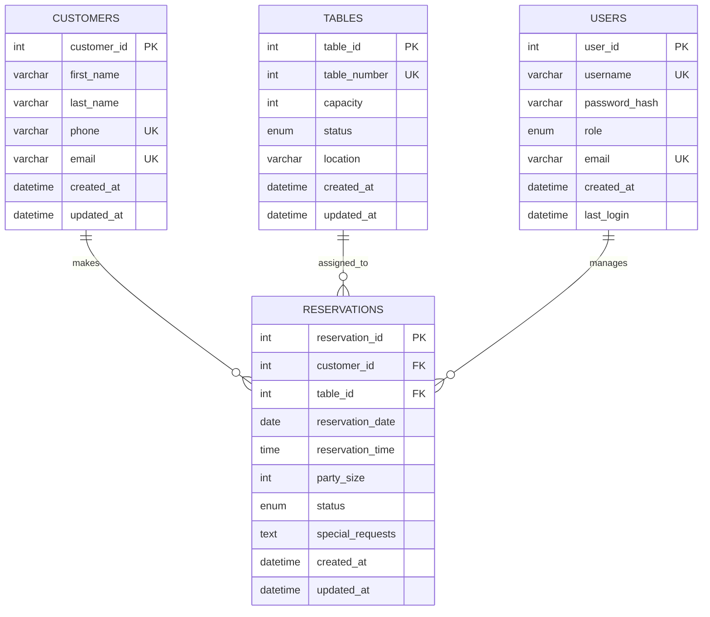
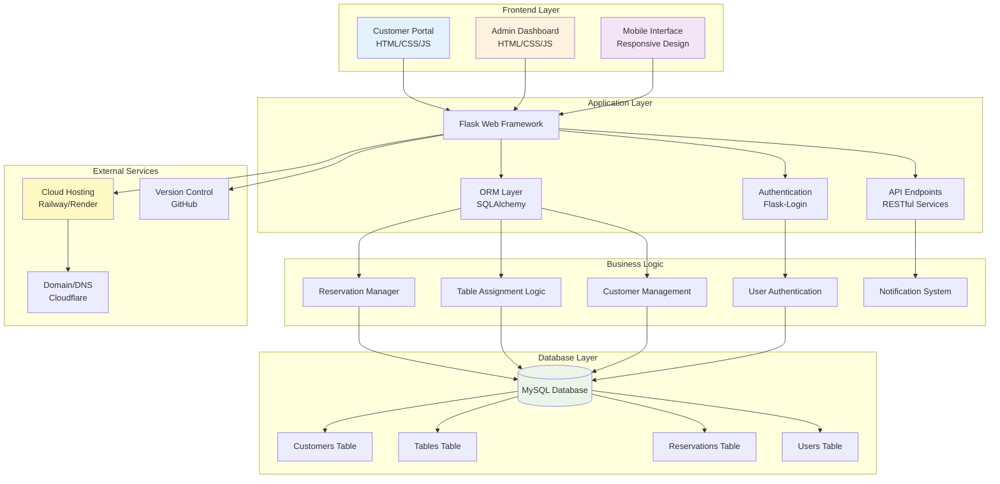

# Restaurant Reservation System - Diagrams and Visual Documentation

## 1. Application Flow Chart

This flowchart shows the complete user journey and system workflow for both customers and administrators.

## 2. Entity Relationship Diagram (ERD)

This ERD shows the database structure and relationships between entities.

## 3. System Architecture Diagram

This diagram illustrates the overall system architecture and component relationships.

## Diagram Explanations

### Application Flow Chart
- **Blue**: Entry points and user interactions
- **Purple**: Customer-facing processes
- **Orange**: Administrative processes
- **Green**: Success states and dashboard
- **Yellow**: System updates and notifications

### ERD Relationships
- **One-to-Many**: One customer can have many reservations
- **One-to-Many**: One table can have many reservations
- **One-to-Many**: One user can manage many reservations
- **Constraints**: Unique constraints on phone, email, username
- **Keys**: Primary keys (PK), Foreign keys (FK), Unique keys (UK)

### System Architecture
- **Frontend Layer**: User interface components
- **Application Layer**: Core Flask framework and services
- **Business Logic**: Application-specific business rules
- **Database Layer**: Data persistence and management
- **External Services**: Deployment and hosting infrastructure

## Technical Specifications

### Database Constraints
- **Primary Keys**: Auto-increment integers for all tables
- **Foreign Keys**: Referential integrity between related tables
- **Unique Constraints**: Prevent duplicate customers and table assignments
- **Check Constraints**: Ensure positive values for capacity and party size
- **Indexes**: Optimized for common query patterns

### API Endpoints
- **GET /api/tables/available**: Check table availability
- **POST /api/reservations**: Create new reservation
- **PUT /api/reservations/{id}/confirm**: Confirm reservation
- **PUT /api/reservations/{id}/cancel**: Cancel reservation
- **GET /api/stats**: System statistics

### Security Features
- **Authentication**: Flask-Login session management
- **Authorization**: Role-based access control
- **Data Protection**: Input validation and sanitization
- **SQL Injection Prevention**: ORM parameterized queries
